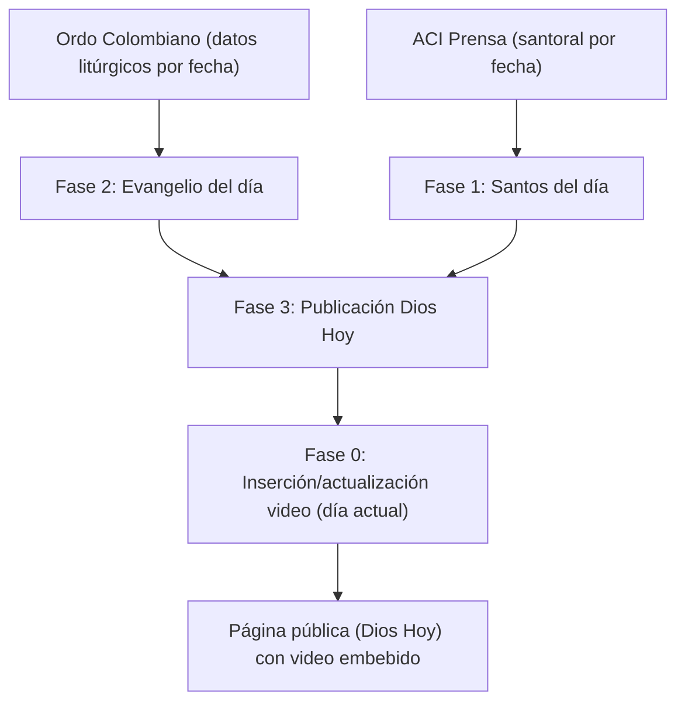

# Plan Maestro: Automatización “Dios Hoy” (Diócesis de Neiva)

## 1) Objetivo

Automatizar, con **GitHub Actions** y automatización de navegador (actualmente Selenium), la creación y publicación del contenido diario del módulo **“Dios Hoy”** en el panel de administración de la Diócesis de Neiva, reduciendo intervención manual y asegurando consistencia en:

- **Título del día** (según tiempo litúrgico y reglas editoriales).
- **Color litúrgico**.
- **Evangelio del día** (selección/creación con base en Ordo Colombiano).
- **Santo del día** (selección/creación con base en ACI Prensa).
- **Autor** (Obispo actual).
- **Reflexión del día** (texto base + video de YouTube insertado automáticamente).

## 2) Estado actual (Fase 0 implementada)

Ya existe una automatización que:

- Inicia sesión en `https://admin.diocesisdeneiva.org`.
- Entra a **Dios Hoy**, selecciona el **día actual**.
- Abre la sección “Evangelio y santo”.
- Entra a “Editar reflexión”.
- Inserta/normaliza el **video más reciente** del canal de YouTube en el editor WYSIWYG, después del marcador `Reflexión del día`.

Detalles: `docs/fases/FASE_0_VIDEO.md`.

## 3) Alcance y No-alcance (para evitar ambigüedades)

### En alcance (MVP del plan)
- Crear/actualizar santos y evangelios (ventana de fechas).
- Crear/actualizar el registro de “Dios Hoy” por fecha (título, color, autor, vínculos a evangelio y santo, reflexión base).
- Mantener la inserción diaria de video (ya existe).
- Idempotencia: re-ejecutar sin duplicar registros.
- Logs + artefactos de depuración.

### Fuera de alcance (por ahora)
- Publicar automáticamente el video en YouTube (se asume que ya existe).
- Generar reflexiones con IA o con contenido no definido por el equipo editorial.
- Traducir o reescribir el texto del Ordo/ACI Prensa.
- Resolver cambios mayores del portal (rediseños) sin mantenimiento.

## 4) Estructura de repo (propuesta y creada)

Esta estructura está pensada para construir por fases sin romper lo ya existente:

```
.
├── .github/workflows/
│   ├── diocesis-schedule.yml                # Fase 0 (ya existe)
│   ├── diocesis-fase1-santos.yml            # (stub, manual)
│   ├── diocesis-fase2-evangelio.yml         # (stub, manual)
│   └── diocesis-fase3-publicacion.yml       # (stub, manual)
├── docs/
│   ├── PLAN_AUTOMATIZACION.md
│   ├── liturgia/
│   ├── fases/
│   ├── fuentes/
│   ├── runbook/
│   └── skills/
├── scripts/                                 # CLI/shells por fase (inicio)
└── import os.py                              # Script actual (Fase 0)
```

Nota: hoy Fase 0 está en un script único (`import os.py`). El plan recomienda, más adelante, modularizar por fases bajo `scripts/` o `src/` sin cambiar el comportamiento.

## 5) Arquitectura (visión)

### Componentes
- **Fuente litúrgica (Ordo Colombiano):** determina tiempo litúrgico, celebraciones, color y referencias bíblicas por fecha.
- **Fuente de santoral (ACI Prensa):** determina santo(s) del día y contenido asociado.
- **Panel Diócesis (admin.diocesisdeneiva.org):** sistema destino donde se crean/seleccionan:
  - Santos.
  - Evangelios.
  - “Dios Hoy” (por fecha).
  - Reflexión (con video).

### Flujo propuesto


## 6) Estrategia por fases (detalle estándar)

Cada fase debe documentarse con el mismo molde:

- **Objetivo**
- **Entradas** (rango de fechas, config, secretos)
- **Fuente de verdad**
- **Salida** (qué queda creado/actualizado)
- **Idempotencia** (cómo evitar duplicados)
- **Algoritmo paso a paso**
- **Errores esperados + mitigación**
- **Validaciones post-ejecución**
- **Criterios de aceptación**

Las especificaciones por fase están en `docs/fases/`.

## 7) Calendario y scheduling (operación)

Se proponen 2 tipos de ejecuciones:

1. **Preparación (futuro cercano)**
   - Ejecuta Fase 1 + Fase 2 + Fase 3 para una ventana futura.
   - Decisión tomada: correr **diario**.
   - Limitación: la UI del Ordo para texto completo parece permitir ~±3 días; por tanto, el “mínimo garantizado” es **hoy..hoy+3** usando Ordo UI.
   - Para rangos mayores, usar fuentes alternas oficiales/confiables con verificación de cita (ver `docs/fuentes/LECTURAS_OFICIALES_ALTERNAS.md`).

2. **Ejecución diaria (día actual)**
   - Ejecuta Fase 0 para el día actual (video en reflexión).
   - Frecuencia: varias veces al día (hoy está programado por horas, ver workflow).

Importante: Fase 3 debe correr **antes** que Fase 0, porque Fase 0 asume que el día ya existe y que se puede editar la reflexión.

## 8) Convenciones y reglas editoriales

### 8.1. Zona horaria
- Todo debe ejecutarse y calcular fechas en `America/Bogota`.

### 8.2. “Título del día” y colores litúrgicos
- Reglas completas: `docs/liturgia/TIEMPOS_LITURGICOS_Y_TITULOS.md`.
- Fuente recomendada para derivar semana/tiempo/color: Ordo Colombiano.

### 8.3. Texto base de reflexión (integración con Fase 0)
- Debe existir el marcador exacto **`Reflexión del día:`** (o el texto acordado) para que la automatización del video sepa dónde insertar.
- Política recomendada:
  - Si el editor ya contiene `Reflexión del día:` dejarlo.
  - Si no existe, insertarlo al inicio del contenido.

## 9) Modelo de datos mínimo (conceptual)

Definir un “objeto día” común entre fases evita inconsistencias:

- `date` (YYYY-MM-DD)
- `liturgical`:
  - `season` (Adviento, Navidad, Cuaresma, Pascua, Ordinario)
  - `week_number` (int) y `week_roman` (string)
  - `celebration_rank` (feria/memoria/fiesta/solemnidad/triduo)
  - `color` (verde, blanco, morado, rojo, rosa)
- `title` (string, formato final para “Título del día”)
- `gospel`:
  - `reference` (p.ej. “Mc 6,30-34”)
  - `source` (Ordo)
  - `admin_id` (si existe en el panel)
- `saint`:
  - `name` (p.ej. “San Tobías”)
  - `source_url` (ACI Prensa)
  - `admin_id` (si existe en el panel)
- `author` (string, “Monseñor …”)
- `reflection`:
  - `body_html` (mínimo con “Reflexión del día:”)
  - `video_embed` (lo gestiona Fase 0)

## 10) Observabilidad y auditoría

Requisitos recomendados:

- Log estructurado por fases (eventos “fase=login”, “fase=guardar_cambios”, etc).
- Artefactos de depuración en fallos:
  - Screenshot PNG.
  - HTML de la página (con redacción básica de tokens).
- Resumen en `GITHUB_STEP_SUMMARY`.
- Conteo y lista de:
  - Días creados/actualizados.
  - Santos creados/actualizados.
  - Evangelios creados/actualizados.

## 11) Seguridad (secrets)

Minimizar el blast radius:

- `DIOCESIS_USERNAME`, `DIOCESIS_PASSWORD` en **GitHub Secrets**.
- No almacenar credenciales en repositorio ni en logs.
- Redactar tokens/sesiones en HTML subido como artefacto.

## 12) Riesgos y mitigaciones (técnicos)

- **CAPTCHA o bloqueos anti-bot** en el login.
  - Mitigación: backoff, artefactos de debug, reducir frecuencia, correr en horarios de baja carga.
- **Cambios del UI / selectores** del panel admin.
  - Mitigación: selectores robustos (por texto+rol), fallbacks, screenshots en fallos.
- **Ambigüedad litúrgica** (p.ej. “Verde o Blanco”, celebraciones locales).
  - Mitigación: política definida + revisión humana previa.
- **Duplicados** (santos/evangelios/días).
  - Mitigación: búsquedas previas y claves únicas (por fecha, por nombre normalizado + fecha, etc).

## 13) Preguntas abiertas (para cerrar el plan)

Estas respuestas son necesarias para convertir el plan en implementación sin incertidumbre:

1. **Fase 1 (Santos):**
   - ¿Cuál es la URL exacta y el formulario del panel para **crear un santo**?
   - ¿Qué campos son obligatorios? (nombre, fecha, biografía, imagen, resumen, fuente…)
   - Decisión tomada: si un día tiene **varios santos** en ACI Prensa, se pueden **crear todos** y, al asociar en “Dios Hoy”, escoger **uno aleatoriamente**.
     - Recomendación técnica (para idempotencia): que la “aleatoriedad” sea **determinística por fecha** (p.ej. hash de `YYYY-MM-DD`) para que re-ejecuciones no cambien el santo seleccionado.

2. **Fase 2 (Evangelio):**
   - ¿Cuál es la URL exacta y el formulario del panel para **crear un evangelio**?
   - ¿Qué campos son obligatorios? (título, cita bíblica, texto completo, audio, tags)
   - ¿Se debe copiar el texto completo del evangelio o basta la **referencia/cita**?

3. **Fase 3 (Dios Hoy):**
   - Confirmado: la existencia del día se detecta por:
     - Color de celda en calendario (no blanco cuando existe).
     - Modal al hacer click:
       - Si existe: título con el “Título del día” y botones `Editar día` y `Evangelio y santo`.
       - Si no existe: título `Día sin registros` y botón `Agregar día`.
   - Confirmado: valores exactos del select “Color del día”:
     - `Verde`, `Morado`, `Rojo`, `Rosado`, `Negro`, `Azul`, `Blanco`.
   - Confirmado: si no se selecciona color, el portal usa el color por defecto del tiempo/celebración; una celebración (fiesta/martirio/etc.) puede sobrescribir el color del tiempo.
   - Política pendiente: manejo de casos “Verde o Blanco” del Ordo (recomendado: si el Ordo trae alternativas, dejar el color sin seleccionar o aplicar criterio editorial definido).

4. **Autor (Obispo):**
   - Confirmar el texto exacto y si debe ser configurable por secret/env (por cambios futuros).

5. **Control editorial:**
- ¿Quién aprueba antes de publicar? ¿Se requiere “modo borrador” o todo queda publicado al guardar?

## 14) Decisiones ya tomadas (log de decisiones)

1. **Varios santos por día (ACI Prensa):**
   - Se crearán **todos** los santos del día.
   - En “Dios Hoy” se seleccionará **uno** de forma aleatoria **determinística** por fecha.
2. **Colores (select del portal):**
   - Valores disponibles: `Verde`, `Morado`, `Rojo`, `Rosado`, `Negro`, `Azul`, `Blanco`.
   - Si no se selecciona color, el portal toma el color por defecto del tiempo/celebración.
3. **Detección de existencia de “Dios Hoy” por fecha:**
   - Por color de celda del calendario + modal (`Editar día` vs `Día sin registros`/`Agregar día`).
